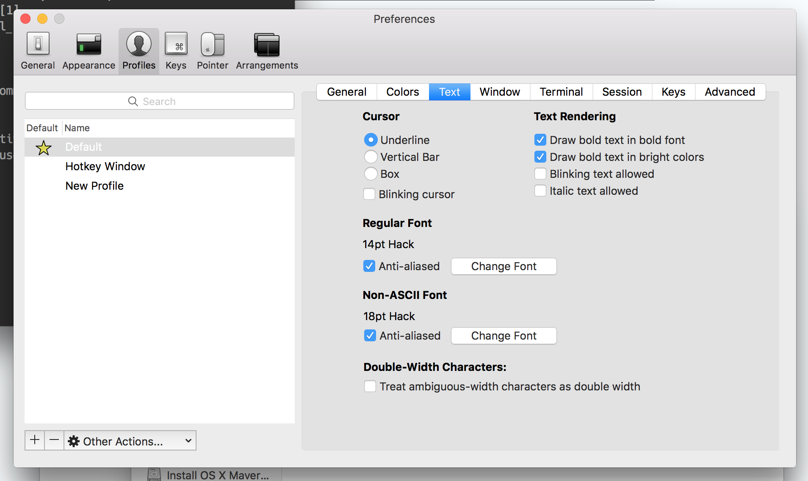

I recently overhauled my terminal. I had a great setup when I was in university, because I relied on the command line a lot, but since doing iOS development I’ve let it slide. All I used it for was git, and the (by now) broken zsh configuration I had seemed to do the job.

I’ve been wanting to try the fish shell for ages, but it wasn’t until I saw it all come together in [Daniel](http://twitter.com/daniel1of1)’s terminal that I finally set aside time to do so. 

## Setting up a hotkey

First things first, easy access. 

I used to have a hotkey for a terminal window. That was the whole reason I used iTerm. Why did I even stop doing that?!

1. Download and install [iTerm2](https://www.iterm2.com) if you’re not using it already
2. Go to preferences (cmd+, as always), “keys” tab
3. Click on “Show/hide iTerm with a system-wide hotkey”
4. Decide on the key (I use alt+space)
3. I would recommend getting a dedicated profile so you can dim the background appropriately
5. Try it!
6. Prettify to your liking under profiles

About the dimming - I like that you can still see bits of the background, hence I’ve got a dedicated profile where I can set the opacity of the background colour. You could also make it your default profile and it will most likely be solid, depending on what you normally use.

## Fish

Secondly, I felt there was more my shell should be doing for me. 

[Fish](http://fishshell.com) suggest things as you type! This reminds me of this [product](http://fishshell.com) I used to work on, lol...

Seriously though, fish predicts commands based on what you’ve typed previously, and you can autocomplete these with the right arrow (or left I suppose, if you’re computer is set to Right to Left? I never tried..).

Installing is easy if you have [homebrew](http://brew.sh): `brew install fish`, done! Don’t worry if you don’t have brew (although I would recommend it), more installation info can be found [here](http://fishshell.com).

## Customised themes

Lastly, I like a pretty shell.

Just like zsh (which I’ve used the past 6 years), fish has an “oh my” version which allows for easy theming. Check it out [here](https://github.com/oh-my-fish/oh-my-fish). 

Like I mentioned, I blatantly copied Daniel and choose the [agnoster](https://github.com/oh-my-fish/oh-my-fish/blob/master/docs/Themes.md#agnoster) theme. Mainly because it has thick chunky bits of colour, and that made it very easy to read. I like it when the prompt is visually quite separate from the commands I will be typing.

Speaking of colour, you can download iTerm profiles / colour schemes from [this awesome site](https://github.com/oh-my-fish/oh-my-fish/blob/master/docs/Themes.md#agnoster). It makes life so much easier! I went for n0tch2k, because I like that muted effect that still has some bright pastel colours. 

Then finally, you need a “powerline font” for Agnoster to work well, or else the arrows won’t show up as expected. If you don’t have those, it may be that your prompt looks a bit like this:

The fonts can be found [here](https://github.com/powerline/fonts), and there is a nice bash script to install them all. 

I opted for **Hack**, and had the non-ASCII font set to a bit larger so that the arrows would match the coloured block precisely. I did this for both the default profile and the hotkey window, by the way. 

And there you have it. I know there’s plenty more customisation that you can do, and I might explore that in the future, but for now I’m glad that I have an easily accessible, smart, and pretty shell to work with.

