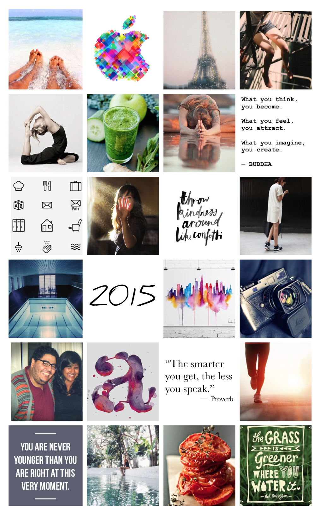

I intended on writing a “thoughts on the year” when I decided to blog again just a few weeks ago, but gosh, has a lot changed since then again. This is gonna be a long one - brace yourselves :).

## 2015

I’ll start right off the bat and say that 2015 was not a great year. Don’t get me wrong, a lot of good things happened, but personally I’ve just not felt that great and here’s a little bit on why.

The year started off pretty decent, as I (and the people I worked with I’m sure) had a much needed, long Christmas break. In 2014 we had a massive crunch time project, trying to ship [SwiftKey for iOS][skios], and I don’t think we managed to allow ourselves to take a breather until the end of the year. I went to the USA and hung out with my family. It was amazing.

I came back to work with renewed energy, but found myself loosing that energy very quickly. Many things around me were changing, and for some reason it got to me. Maybe it was work, maybe I was long overdue another episode, but I found myself getting more and more depressed again. So much so, that around April our wonderful head of HR told me to go home. “Don’t worry about it, just focus on yourself. Just take some time.”

It’s a relief hearing this from your employer, when you try so hard to do the best you can at work and often feel like you can’t show any weakness. I took this week to think about what it is that I wanted to do. Maybe it was time for a shift in my day to day. Up until this point, I had been doing more design work, and had been asking for it also, but what if I could somehow formalise it more? Structure it better?

What that requires though, is an understanding and acceptance that someone can genuinely do both crafts to a certain standard. This is something that is, I think, still hard to swallow for many. And for me, at that point, I felt like I could no longer choose between engineering and design. If anything, I was leaning more and more to doing design full time because there was a point where I felt I lost any faith in myself being a decent engineer.

This was the first time I’ve ever been depressed while in a work environment. It wasn’t high school, it wasn’t uni. I couldn’t give myself the break I needed and then make up for lost time by hitting exams hard. I couldn’t avoid people. Instead, I had to come into work every day and face stand-up. Never had I come to hate an agile practice more. How do you say “I felt absolute rubbish yesterday and barely managed to get out of bed let alone be productive. Oh and today isn’t much better”?

So started a completely new chapter of my life. Anxiety.

I felt like I had to continuously keep up appearances at work, so I over-promised on things, and worked myself into the ground trying to complete them despite feeling depressed. This meant there were no evenings anymore. No weekends anymore. Just continuous guilt over trying to finish something that _should_ be a simple task. And the more this happened, the more I started believing that clearly it was me - I was no longer capable of writing code.

Somewhere in this cycle of avoidance, pressure, and sadness, my body gave up. I had been feeling chest pains for a long while already, but I didn’t know I was genuinely experiencing anxiety symptoms. At some point in June, I had a panic attack.

For those of you who don’t know what panic attacks are, they are in all honesty pretty harmless. But they are terrifying when you’re in them. You feel like you’ve lost all control over your body. Your body goes into full fright or flight mode, and I found myself shaking, crying, and hyper ventilating for well over an hour. You’re not dying and you know it, but you feel like you do.

My boyfriend tried to keep me calm over the phone while a good friend rushed over to my place to take me to A&E (on recommendation of my GP). After what, retrospectively, turned out to be a pretty hilarious few hours in hospital (we ordered Deliveroo!), I was literally given a chill pill and told that I should really take a break from work. Not only that, this was something I now needed to “manage”.

I felt pretty broken. Anything and everything started affecting me. As I have quoted to many already, it got to a point that Tesco could’ve run out of spinach and tears would start welling up in my eyes. I just could no longer handle the world.

I decided I needed a change. A lot had changed at work, and it no longer seemed like the right fit. I was offered another job that I was quite excited about and I decided to take the leap. Making these changes (and more) felt great, because I felt like I was in control again.

Now comes the part that’s probably the hardest for me to talk about. I ignored my instincts and it got me into a pretty shitty situation. The new job didn’t feel right, not from day one. I had read [Ash’s post][ash5yr] and remember how he once quit upon starting. I desperately wanted to, but because everything that had happened this year I declared that it must’ve been me. I ignored how I felt, and pushed forward.

I started on a new codebase, a new challenge, and it was amazing. I found such joy in development again and if there’s one thing I take away from this it’s that. And I am immensely grateful for it. Turns out I’m actually a pretty decent engineer, at least, more so than I thought of myself 4 months prior. Faith in myself returned and I was doing great again.

What I couldn’t get on board with is just about everything else. The way things were done and run were just not what I had imagined, nor what I was told to expect. I figured that a lot of it was because it was a small and young place. Friends of mine had faced the challenge of being in a startup, surely this couldn’t be any different. I spoke up. I tried to stand up for what I believed in and affect positive change. But it seemed as if the more I did that, the more things went in the opposite direction.

Just two months in, I decided to quit. I felt like I was giving up, but after everything this year, I felt that I could no longer work in a place where the culture was so out of touch with how I saw things. It just wasn’t worth the dread of going into work. There were other places I could contribute to in a much healthier way.

Never, ever, did I expect to face the backlash I did when I announced my resignation (whilst still on probation period - that’s what they’re for right?). I was aware that this would not be great for them and I wanted to work together on a good outcome. But they made things personal, and that was just a blow below the belt.

I had come quite far in getting better. My therapist, who makes me fill out some point based survey every time I see her, said that before this I was essentially considered “recovered”. After this I scored the worst I had until date. Eventually I had a panic attack on the tube. I somehow managed to get above ground, find a corner on a street, and break down until my boyfriend came running to find me and take me home. He has been amazing in all of this. This was the second time I had a panic attack, and hopefully the last.

My GP suggested medication and I, after giving it quite some thought, refused. Earlier this year it was me. I was feeling terrible and I was putting myself through unnecessary anxiety. It could’ve made sense then. This time around, it was not me. It was circumstantial and I trust myself to never ever put myself in this kind of situation again. I can’t tell you how proud I am that I had the guts to quit.

Which leads me to the good of 2015, because I promise you, there is quite a lot of that too! The above may have been the dominating theme, but actually, a whole host of things were absolutely awesome.  A lot of that is thanks to the fact that I reminded myself of it every day: I had a small “visionboard” on my phone’s lock screen. Let’s take a look at what I did managed to achieve.

I assembled visual representations of various personal goals I had for this year ([Pinterest][menneniapin] was a useful source of imagery), to remind me long after most new year’s resolutions have been forgotten. I purposefully didn’t make them massively centered around work. I wanted them to be about random things I was interested in.

From left to right, top to bottom:

1. Go lie on a beach
1. Go to WWDC
1. Go to Paris with my mum
1. Make the most out of sunny days
1. Master the pidgeon pose in yoga
1. Get into drinking my green juices again (or [“Swamp Juice”](https://twitter.com/PeterHolc/status/570540664200540160) as my fellow SwiftKeyers would call it)
1. Practice gratitude
1. Envision and going after what I want
1. Designing and shipping a native icon library
1. Being less afraid
1. Being kind
1. Put effort into what I wear
1. Go to Berlin again
1. -
1. Make a panting
1. Get back into photography
1. See at least one friend from a different continent that I hadn’t in a while
1. Work more on illustrations
1. Shut up and listen more
1. Do a 5k run
1. Be more spontaneous
1. Go somewhere alone
1. Get back into cooking
1. Putting effort into what I want to get better at

### Go lie on a beach ✅😍

I went to Dubai to visit a friend and we went to the beach! It was sooo relaxing. I ended up going by myself a few times too.

### Go to WWDC ✅😆

I was hoping to simply partake in the lottery and otherwise go anyway. There is usually so much [going on][alt] in SF that time of year, that it’s well worth just hanging out. This year however, Apple opened up their scholarship to women also. I spent a pretty solid 36 hours writing the submission app and was awarded a free ticket to WWDC. [Say what?!](https://twitter.com/mostgood/status/607714269522620416) Definitely one of the highlights of the year, not to mention I got to meet [this guy][timselfie] and listen to [The Weeknd live][weekndwwdc] ([Honza] had to keep me from bouncing off my chair).

### Go to Paris with my mum ❌😔

Unfortunately this didn’t work out, as I was travelling so much this year already. Quite gutted, but we’re trying to work things out for next year.

### Make the most out of sunny days ✅😊

Due to all the “not wanting to leave the house”, I feel like I didn’t make use of the summer as much as I would’ve otherwise, but I still spent a good deal outdoors and on our patio. I love the feel of sun on my skin, and I think that I did experience that a decent amount this year.

### Master the [pidgeon pose][pidgey] in yoga ❌😠😭

You know that feeling when you roll out your mat, you stare at it, you do one or two poses and you just end up in child’s pose not wanting to do anything else? That has been me all year. 2014 was a fantastic yoga year, 2015 was not. I am making it a top priority for 2016.

### Get into drinking my green juices again ✅👌

I did this a lot. It’s still not every single day (keeping the supply of spinach incoming isn’t always easy), but a lot of what I have consumed this year has been in the form of green coloured juices and smoothies. Nom!

### Practice gratitude ✅☺️

I contribute my overall “being cheery” to this and I believe it’s what kept me going this year. A lot of things have been wonderful and I am immensely thankful for it. I think it’s quite telling when, whilst being depressed, almost everyone on my SwiftKey leaving card wrote that my positive energy and attitude is what will be missed.

### Envision and going after what I want ✅🙂

As much as I was filled with doubt, I think I managed to have the sense to look at what needed changing and taking the leap(s).

### Designing and shipping a native icon library ❌❓😯

A project I’ve been wanting to work on for a long time. It means combining my love for code and design, as well as just making my first pod. I am _trying_ to get the simplest version of it out before the end of the year.

### Being less afraid ✅🙂

Funnily enough, I think this worked out pretty well. My body has never felt this scared in my life, yet my mind is slowly becoming more and more resilient than ever.

### Being kind - 🤔

I’d like to think I’ve done this. I have received quite some positive feedback, though I’m sure I’ve managed to piss people off also. Some of these things are continuous journeys. I could be kinder to myself however, and in the last few months I have tried to make improvements there also.

### Put effort into what I wear ✅😎

I cleared out my closet, leaving only choice pieces that all fit together properly. I don’t even need to think twice about getting dressed in the morning and feel good in just about everything I own. Absolute win, if you ask me.

### Go to Berlin again ✅😊

Berlin holds a special place in my heart and it was great being there again. Even more so, because I was asked to [speak at UIKonf][maximuikonf]! Whilst not my best talk (in my opinion), it seemed to definitely be one of my best received talks :). It talks a lot about the struggle of being stuck between design and development, and it hopes to point out something I feel strongly about in our industry: this idea that one aspect of making a product can be considered “better” than others - something I fundamentally disagree with. I remember being a bit nervous about going out there and calling us developers a bunch of arrogant people. The audience was amazing however, and seemed to be fine with it!

### 2015.. ✅😅

I made it through the year I guess? 

### Make a panting ✅😃

I went to a live drawing class this year, and made a [sketch][drawingtweet] (nswf) I was pretty happy with! In general, I’ve gotten more into painting again. I’m still trying to dedicate more time to it, but it’s headed in the right direction.

### Get back into photography ❌😕

Apart from this one picture I took this year that I’m pleased with, I basically didn’t pick up my DSLR at all. I’m now at a stage where I’m not sure whether to sell it, or give it another go.

### See at least one friend from a different continent that I hadn’t in a while ✅💯😄

I saw a friend in Dubai, another one in California, another in Berlin, another from Amsterdam, and one of my favourite people is visiting from Canada in a few days. This year has been great for seeing my besties from all around the world. I am so happy to have them in my life.

### Work more on illustrations ✅🙂

While I didn’t design and print an illustration to hang on a wall (as was my intention), I did get into creating more and more visual pieces. From checklists, to roadmaps, to icons, to scenery, to processes, it’s lowered the barrier of opening Sketch / Affinity Designer and just making what’s in my head.

### Shut up and listen more ✅❓😶

For anyone that knows me in real life, I talk. A lot. I’d like to think that I’m pretty interactive when I chat and also listen, but still. I talk a lot. Considering I have always been like this (my mum got me [“Little Miss Chatterbox”][littlemisschat] when I was four), I think I took a step in the right direction for improving it. I did try and listen more actively this year. The funny thing with that is, you start to realise how not a lot of people always make sense... So in turn I’ve been trying to be more concrete in what message I try to deliver to others and just get to the point more often. It’s a work in progress.

### Do a 5k run ✅😀

What can I say. [Did it][5k]. Not in the time I had originally set for myself, but then again, I didn’t train. That’s okay. I still turned up to the race and I ran. And it felt _great_.

### Be more spontaneous ✅☺️

That’s how I choose to interpret this quote at least. I did some really fun and wild things this year. I somehow felt like I did more of it the year before, but that’s okay. It led me to experience great times.

### Go somewhere alone ✅❓😯

This is the first year I didn’t manage to get in a full solo trip, but I did travel to Dubai to see my friend who was often working, so a good chunk of that trip was just me. I went to Italy on my own for Pragma, but then some of that was spent with [awesome][ash] [friends][orta] [from][chris] [around][marin] [the world][graham].

### Get back into cooking ✅😉

I’ve made some pretty awesome things this year, the highlight of which has been my most recent “brownie cookies”. Yes, they are as amazing as they sound! I saw a lot of myself in [Ash’s Pragma talk][ashpragma], where he describes the road to expertise. There are a lot of things that I’m decent at, I’m trying to get better at, and I just plain suck at. Cooking is one of those that I _know_ I’m great at.

### Putting effort into what I want to get better at ✅😊

I think if anything, this is something I continued striving for and something that I have been most proud of. I may have felt like there were times when I threw in the towel, but I don’t think I did. The easy route is to complain, and I think I consciously choose to instead try and improve what I could. Myself, my health, my career, my relationships, and so forth. I am lucky that my friends also describe me as someone who doesn’t give up. It’s reassuring to know I can count on myself.

### Great things that weren’t on the board, but still happened:
- Speaking at AltConf, iOSDevUK, BeyondConf and more
- Hosting [my first workshop](https://twitter.com/mennenia/status/652424847864279041)
- Moving in with my boyfriend
- Hiking and sauna-ing in Switzerland [with friends](https://twitter.com/steipete/status/614519187298385921)
- Visiting [Poland with the iOS team](https://twitter.com/mennenia/status/596388642098151425) for [random shits and giggles](https://twitter.com/chetbox/status/600321379607683073)
- Being back [in Edinburgh](https://twitter.com/mennenia/status/672761120311140352)
- Be taken on a surprise birthday trip to my favourite spa
- Attending two cocktail courses - I now know a lot about rum and gin
- Practicing mindfulness and meditations regularly
- Blogging again (even though I didn’t complete [NaNoWriBlo])
- Being on a [podcast]

I stand by the fact that, in many ways, I had an amazing year. I developed as a person. Shit happens, yet life goes on. I still have all my loved ones in my life, which at the end of the day is all that matters to me - they are irreplaceable. A huge shout out to them for supporting me along the way.

I have great plans for 2016, and a new board is in the making. I will however spare you any more text and post it separately. If you managed to read all the way till the end - thank you :).

Hope your year was lovely, and wishing you all the best for the next!

Happy holidays,
Maxim

[skios]: https://swiftkey.com/en/keyboard/ios
[ash5yr]: https://ashfurrow.com/blog/5-years-of-ios/
[menneniapin]: https://www.pinterest.com/mennenia/
[ash]: https://twitter.com/ashfurrow
[orta]: https://twitter.com/orta
[chris]: https://twitter.com/chriseidhof
[graham]: https://twitter.com/iwasleeg
[marin]: https://twitter.com/icanzilb
[littlemisschat]: http://www.goodreads.com/book/show/138128.Little_Miss_Chatterbox
[ashpragma]: https://www.youtube.com/watch?v=hlLhtWLghGA
[NaNoWriBlo]: http://www.mennenia.com/articles/2015-11-01-nablowrimo/
[timselfie]: https://twitter.com/mennenia/status/607671952040423425
[drawingtweet]: https://twitter.com/mennenia/status/579329667779395585
[maximuikonf]: https://www.youtube.com/watch?v=gSnUt9ZfslM
[pidgey]: http://www.yogajournal.com/pose/one-legged-king-pigeon-pose/
[alt]: http://altconf.com
[weekndwwdc]: https://www.youtube.com/watch?v=KwpKoi5Nbxk
[Honza]: https://twitter.com/czechboy0
[podcast]: http://www.mennenia.com/articles/2015-11-10-firstpodcast/
[5k]: https://twitter.com/mennenia/status/655719743836528640